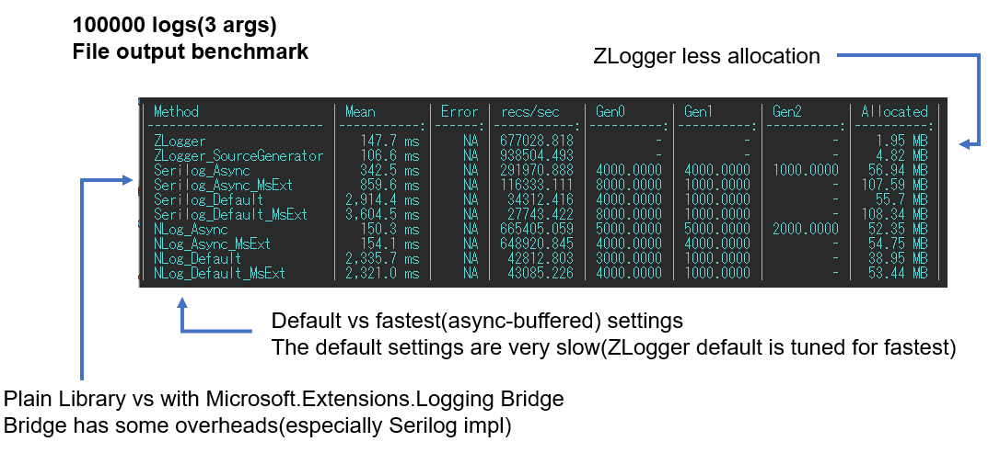
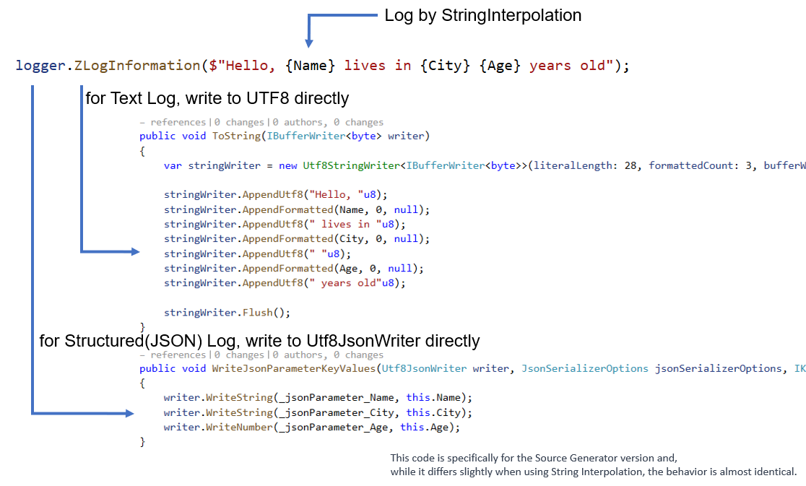

ZLogger
===
[](https://github.com/Cysharp/ZLogger/actions) [](https://github.com/Cysharp/ZLogger/releases)

**Z**ero Allocation Text/Structured **Logger** for .NET and Unity, with StringInterpolation and Source Generator, built on top of a `Microsoft.Extensions.Logging`.

The usual destinations for log output are `Console(Stream)`, `File(Stream)`, `Network(Stream)`, all in UTF8 format. However, since typical logging architectures are based on Strings (UTF16), this requires additional encoding costs. In ZLogger, we utilize the [String Interpolation Improvement of C# 10](https://devblogs.microsoft.com/dotnet/string-interpolation-in-c-10-and-net-6/) and by leveraging .NET 8's [IUtf8SpanFormattable](https://learn.microsoft.com/en-us/dotnet/api/system.iutf8spanformattable?view=net-8.0), we have managed to avoid the boxing of values and maintain high performance by consistently outputting directly in UTF8 from input to output.

ZLogger is built directly on top of `Microsoft.Extensions.Logging`. `Microsoft.Extensions.Logging` is an official log abstraction used in many frameworks, such as ASP.NET Core and Generic Host. However, since regular loggers have their own systems, a bridge is required to connect these systems, and this is where a lot of overhead can be observed. ZLogger eliminates the need for this bridge, thereby completely avoiding overhead.



This benchmark is for writing to a file, but the default settings of typical loggers are very slow. This is because they flush after every write. In the benchmark, to ensure fairness, careful attention was paid to set the options in each logger for maximum speed. ZLogger is designed to be the fastest by default, so there is no need to worry about any settings.

The slowness of this default setting is due to I/O, so it can be mitigated by using a faster drive. When taking benchmarks, please note that the results can vary greatly not only on your local (which is probably fast!) but also on drives attached to the cloud and in environments like Docker. One of the good points about the async-buffered setting is that it can reduce the impact of such I/O issues.

ZLogger focuses on the new syntax of C#, and fully adopts Interpolated Strings.



This allows for providing parameters to logs in the most convenient form. Also, by closely integrating with System.Text.Json's Utf8JsonWriter, it not only enables high-performance output of text logs but also makes it possible to efficiently output structured logs.

ZLogger also emphasizes console output, which is crucial in cloud-native applications. By default, it outputs with performance that can withstand destinations in cloud log management. Of course, it supports both text logs and structured logs.

ZLogger delivers its best performance with .NET 8 and above, but it is designed to maintain consistent performance with .NET Standard 2.0 and .NET 6 through a fallback to its own IUtf8SpanFormattable.

As for standard logger features, it supports loading LogLevel from json, filtering by category, and scopes, as found in Microsoft.Extensions.Logging. In terms of output destinations, it is equipped with sufficient capabilities for `Console`, `File`, `RollingFile`, `InMemory`, `Stream`, and an `AsyncBatchingProcessor` for sending logs over HTTP and similar protocols.

<!-- START doctoc generated TOC please keep comment here to allow auto update -->
<!-- DON'T EDIT THIS SECTION, INSTEAD RE-RUN doctoc TO UPDATE -->
## Table of Contents

- [Getting Started](#getting-started)
- [Logging Providers](#logging-providers)
  - [Console](#console)
  - [File](#file)
  - [RollingFile](#rollingfile)
  - [Stream](#stream)
  - [In-Memory](#in-memory)
  - [LogProcessor](#logprocessor)
- [Formatter Configurations](#formatter-configurations)
  - [PlainText](#plaintext)
  - [JSON](#json)
    - [KeyNameMutator](#keynamemutator)
  - [MessagePack](#messagepack)
  - [Custom Formatter](#custom-formatter)
- [LogInfo](#loginfo)
- [ZLoggerOptions](#zloggeroptions)
- [ZLoggerMessage Source Generator](#zloggermessage-source-generator)
- [Microsoft.CodeAnalysis.BannedApiAnalyzers](#microsoftcodeanalysisbannedapianalyzers)
- [Global LoggerFactory](#global-loggerfactory)
- [Unity](#unity)
  - [Installation](#installation)
  - [Basic usage](#basic-usage)
- [License](#license)

<!-- END doctoc generated TOC please keep comment here to allow auto update -->

Getting Started
---
This library is distributed via NuGet, supporting `.NET Standard 2.0`, `.NET Standard 2.1`, `.NET 6(.NET 7)` and `.NET 8` or above. 
For Unity, the requirements and installation process are completely different. See the [Unity](#unity) section for details.

> dotnet add package [ZLogger](https://www.nuget.org/packages/ZLogger)

Here is the most simple sample on ASP.NET Core.

```csharp
using ZLogger;

var builder = WebApplication.CreateBuilder(args);

builder.Logging.ClearProviders();
builder.Logging.AddZLoggerConsole();
```

You can get logger from dependency injection.

```csharp
@page
@using ZLogger;
@inject ILogger<Index> logger
@{
    logger.ZLogInformation($"Requested path: {this.HttpContext.Request.Path}");
}
```

This simple logger setup is possible because it is integrated with `Microsoft.Extensions.Logging` by default. For reference, here's how you would set it up using [LoggerFactory](https://learn.microsoft.com/en-us/dotnet/core/extensions/logging):

```csharp
using Microsoft.Extensions.Logging;
using ZLogger;

using var factory = LoggerFactory.Create(logging =>
{
    logging.SetMinimumLevel(LogLevel.Trace);

    // Add ZLogger provider to ILoggingBuilder
    logging.AddZLoggerConsole();
    
    // Output Structured Logging, setup options
    // logging.AddZLoggerConsole(options => options.UseJsonFormatter());
});

var logger = factory.CreateLogger("Program");

var name = "John";
var age = 33;

// Use **Z**Log method and string interpolation to log message
logger.ZLogInformation($"Hello my name is {name}, {age} years old.");
```

Normally, you don't create LoggerFactory yourself. Instead, you set up a Generic Host and receive ILogger through dependency injection (DI). You can setup logger by [.NET Generic Host](https://learn.microsoft.com/en-us/aspnet/core/fundamentals/host/generic-host?view=aspnetcore-8.0)(for ASP.NET Core) and if you want to use this in ConsoleApplication, we provides [ConsoleAppFramework](https://github.com/Cysharp/ConsoleAppFramework) to use hosting abstraction.

Here is the showcase of providers.

```csharp
using ZLogger;

var builder = Host.CreateApplicationBuilder();

builder.Logging
    // optional(MS.E.Logging):clear default providers(recommend to remove all)
    .ClearProviders()

    // optional(MS.E.Logging):setup minimum log level
    .SetMinimumLevel(LogLevel.Trace)
    
    // Add to output to console
    .AddZLoggerConsole();

    // Add to output to the file
    .AddZLoggerFile("/path/to/file.log")
    
    // Add to output the file that rotates at constant intervals.
    .AddZLoggerRollingFile(options =>
    {
        // File name determined by parameters to be rotated
        options.FilePathSelector = (timestamp, sequenceNumber) => $"logs/{timestamp.ToLocalTime():yyyy-MM-dd}_{sequenceNumber:000}.log";
        
        // The period of time for which you want to rotate files at time intervals.
        options.RollingInterval = RollingInterval.Day;
        
        // Limit of size if you want to rotate by file size. (KB)
        options.RollingSizeKB = 1024;        
    })    
    
    // Add to output of simple rendered strings into memory. You can subscribe to this and use it.
    .AddZLoggerInMemory(processor =>
    {
        processor.MessageReceived += renderedLogString => 
        {
            System.Console.WriteLine(renderedLogString);    
        };
    })
    
    // Add output to any steram (`System.IO.Stream`)
    .AddZLoggerStream(stream);

    // Add custom output
    .AddZLoggerLogProcessor(new YourCustomLogExporter());
    
    // Format as json
    .AddZLoggerConsole(options =>
    {
        options.UseJsonFormatter();
    })
    
    // Format as json and configure output
    .AddZLoggerConsole(options =>
    {
        options.UseJsonFormatter(formatter =>
        {
            formatter.IncludeProperties = IncludeProperties.ParameterKeyValues;
        });
    })

    // Further common settings
    .AddZLoggerConsole(options =>
    {
        // Enable LoggerExtensions.BeginScope
        options.IncludeScopes = true;
        
        // Set TimeProvider
        options.TimeProvider = yourTimeProvider
    });
```

Look at the use of loggers and the syntax of ZLog.

```cs
using Microsoft.Extensions.Logging;
using ZLogger;

// get ILogger<T> from DI.
public class MyClass(ILogger<MyClass> logger)
{
    // name = "Bill", city = "Kumamoto", age = 21
    public void Foo(string name, string city, int age)
    {
        // plain-text:
        // Hello, Bill lives in Kumamoto 21 years old.
        // json:
        // {"Timestamp":"2023-11-30T17:28:35.869211+09:00","LogLevel":"Information","Category":"MyClass","Message":"Hello, Bill lives in Kumamoto 21 years old.","name":"Bill","city":"Kumamoto","age":21}
        // json(IncludeProperties.ParameterKeyValues):
        // {"name":"Bill","city":"Kumamoto","age":21}
        logger.ZLogInformation($"Hello, {name} lives in {city} {age} years old.");
    
        // Explicit property name, you can use custom format string start with '@'
        logger.ZLogInformation($"Hello, {name:@user-name} id:{100:@id} {age} years old.");
    
        // Dump variables as JSON, you can use custom format string `json`
        var user = new User(1, "Alice");

        // user: {"Id":1,"Name":"Bob"}
        logger.ZLogInformation($"user: {user:json}");
    }
}
```

All standard `.Log` methods are processed as strings by ZLogger's Provider. However, by using our unique `.ZLog*` methods, you can process them at high performance while remaining in UTF8. Additionally, these methods support both text logs and structured logs using String Interpolation syntax.

All logging methods are completely similar as [Microsoft.Extensions.Logging.LoggerExtensions](https://docs.microsoft.com/en-us/dotnet/api/microsoft.extensions.logging.loggerextensions), but it has **Z** prefix overload.

The ZLog* method uses [InterpolatedStringHandler](https://learn.microsoft.com/en-us/dotnet/csharp/whats-new/tutorials/interpolated-string-handler) in .NET and prepare the template at compile time.

Some special custom formats are also supported. The `:@` can be used when you want to explicitly give the structured log a name other than the name of the variable to capture. `:json` can be used to log the result of JsonSerializing an object.

The `@` parameter name specification and format string can be used together.

```csharp
// Today is 2023-12-19.
// {"date":"2023-12-19T11:25:34.3642389+09:00"}
logger.ZLogDebug($"Today is {DateTime.Now:@date:yyyy-MM-dd}.");
```

Logging Providers
---
By adding Providers, you can configure where the logs are output. ZLogger has the following providers.

| Type                                   | Alias               | Builder Extension      |
|----------------------------------------|---------------------|------------------------|
| ZLoggerConsoleLoggerProvider           | ZLoggerConsole      | AddZLoggerConsole      |
| ZLoggerFileLoggerProvider              | ZLoggerFile         | AddZLoggerFile         |
| ZLoggerRollingFileLoggerProvider       | ZLoggerRollingFile  | AddZLoggerRollingFile  |
| ZLoggerStreamLoggerProvider            | ZLoggerStream       | AddZLoggerStream       |
| ZLoggerInMemoryProcessorLoggerProvider | ZLoggerInMemory     | AddZLoggerInMemory     |
| ZLoggerLogProcessorLoggerProvider      | ZLoggerLogProcessor | AddZLoggerLogProcessor |

All Providers can take an Action that sets `ZLoggerOptions` as the last argument. As follows.

```cs
builder.Logging
    .ClearProviders()

    // Configure options
    .AddZLoggerConsole(options => 
    {
        options.LogToStandardErrorThreshold = LogLevel.Error;
    });
    
    // Configure options with service provider
    .AddZLoggerConsole((options, services) => 
    {
        options.TimeProvider = services.GetService<YourCustomTimeProvider>();
    });
```

If you are using `Microsoft.Extensions.Configuration`, you can set the log level through configuration. In this case, alias of Provider can be used.  for example:

```json
{
  "Logging": {
    "LogLevel": {
      "Default": "Information"
    },
    "ZLoggerConsoleLoggerProvider": {
      "LogLevel": {
        "Default": "Debug"
      }
    }
  }
}
```

Each Provider's behavior can be modified using the common `ZLoggerOptions`. For details, please refer to the [ZLoggerOptions](#zloggeroptions) section. Additionally, you can customize structured logging (JSON Logging) using the `UseFormatter` method within these options. For more information on this, check the [Formatter Configurations](#formatter-configurations) section.

### Console

Console writes to the standard output. Console output is not only for development purposes, but also serves as a standard log input port in containerized and cloud environments, making performance critically important. ZLogger has been optimized to maximize console output performance.

```csharp
logging.AddZLoggerConsole();
```

If you are using `ZLoggerConsoleLoggerProvider`, the following additional options are available:

| Name                                    | Description                                                                                                                               |
|:----------------------------------------|:------------------------------------------------------------------------------------------------------------------------------------------|
| `bool OutputEncodingToUtf8`             | Set `Console.OutputEncoding = new UTF8Encoding(false)` when the provider is created.  (default: true)                                     |
| `bool ConfigureEnableAnsiEscapeCode`    | If set true, then configure console option on execution and enable virtual terminal processing(enable ANSI escape code). (default: false) |
| `LogLevel LogToStandardErrorThreshold`  | If set, logs at a higher level than the value will be output to standard error. (default: LogLevel.None)                                  |

### File

File outputs text logs to a file. This is a Provider that writes to a single file in append mode at high speed.

```csharp
logging.AddZLoggerFile("log.txt");
```

If you are using `ZLoggerFileLoggerProvider`, the following additional options are available:

| Name                                                                              | Description                                                                                                        |
|:----------------------------------------------------------------------------------|:-------------------------------------------------------------------------------------------------------------------|
| `bool fileShared`                                                                  | If set true, enables exclusive control of writing to the same file from multiple processes.(default: false) |

### RollingFile

RollingFile is a Provider that dynamically changes the output file based on certain conditions.

```csharp
// output to  yyyy-MM-dd_*.log, roll by 1MB or changed date
logging.AddZLoggerRollingFile((dt, index) => $"{dt:yyyy-MM-dd}_{index}.log", 1024 * 1024);
```

If you are using `ZLoggerRollingFileLoggerProvider`, the following additional options are available:

| Name                                                                              | Description                                                                                                        |
|:----------------------------------------------------------------------------------|:-------------------------------------------------------------------------------------------------------------------|
| `Func<DateTimeOffset, int, string> fileNameSelector`                              | The Func to consturct the file path. `DateTimeOffset` is date of file open time(UTC), `int` is number sequence.        |
| `RollingInterval rollInterval`                                                    | Interval to automatically rotate files.                                                                            |
| `int rollSizeKB`                                                                  | Limit size of single file.  If the file size is exceeded, a new file is created with the sequence number moved up. |
| `bool fileShared`                                                                  | If set true, enables exclusive control of writing to the same file from multiple processes.(default: false) |


### Stream

Stream can output logs to any arbitrary Stream. For example, if you output to a MemoryStream, you can retrieve the rendered results in memory. If you pass a NetworkStream such as TCP, it will write logs over the network.

```csharp
var ms = new MemoryStream();
logging.AddZLoggerStream(ms);
```

### In-Memory

InMemory allows you to retrieve rendered strings as they are generated. It can be conveniently used for purposes such as accumulating logs in a `List<string>` or `Queue<string>` for display on screen.

```csharp
logging.AddZLoggerInMemory(processor =>
{
    processor.MessageReceived += msg =>
    {
        Console.WriteLine($"Received:{msg}");
    };
});
```

If you are using `ZLoggerInMemoryLoggerProvider`, the following additional options are available:

| Name                                                                                                            | Description |
|:----------------------------------------------------------------------------------------------------------------|:------------|
| `string processorKey`                                                                                           |  If specified, `InMemoryObservableLogProcessor` is registered in the DI container as a keyed service and can be retrieved by name.           |
| `Action<InMemoryObservableLogProcessor> configureProcessor`                                                     |  Custom actions can be added that use processors instead of DI containers.           |

### LogProcessor

LogProcessor is the most primitive Provider that allows you to customize output on a per-log basis (`IZLoggerEntry`) by implementing a custom `IAsyncLogProcessor`.

```csharp
public interface IAsyncLogProcessor : IAsyncDisposable
{
    void Post(IZLoggerEntry log);
}
```

For example, a LogProcessor that propagates logs as string events can be written as follows:

```csharp
public class SimpleInMemoryLogProcessor : IAsyncLogProcessor
{
    public event Action<string>? OnMessageReceived;

    public void Post(IZLoggerEntry log)
    {
        var msg = log.ToString();
        log.Return();
        
        OnMessageReceived?.Invoke(msg);
    }

    public ValueTask DisposeAsync()
    {
        return default;
    }
}
```

```csharp
var processor = new SimpleInMemoryLogProcessor();
processor.OnMessageReceived += msg => Console.WriteLine(msg);

logging.AddZLoggerLogProcessor(processor);
```

Note that `IZLoggerEntry` is pooled, so you must always call `Return()`.

Here's a more complex example. `BatchingAsyncLogProcessor` can batch logs together, which is useful for scenarios like sending multiple log lines via HTTP in a single request.

```csharp
public class BatchingHttpLogProcessor : BatchingAsyncLogProcessor
{
    HttpClient httpClient;
    ArrayBufferWriter<byte> bufferWriter;
    IZLoggerFormatter formatter;

    public BatchingHttpLogProcessor(int batchSize, ZLoggerOptions options)
        : base(batchSize, options)
    {
        httpClient = new HttpClient();
        bufferWriter = new ArrayBufferWriter<byte>();
        formatter = options.CreateFormatter();
    }

    protected override async ValueTask ProcessAsync(IReadOnlyList<INonReturnableZLoggerEntry> list)
    {
        foreach (var item in list)
        {
            item.FormatUtf8(bufferWriter, formatter);
        }
        
        var byteArrayContent = new ByteArrayContent(bufferWriter.WrittenSpan.ToArray());
        await httpClient.PostAsync("http://foo", byteArrayContent).ConfigureAwait(false);

        bufferWriter.Clear();
    }

    protected override ValueTask DisposeAsyncCore()
    {
        httpClient.Dispose();
        return default;
    }
}
```

In this case, the LogEntry is NonReturnable, so there's no need to call Return().

Formatter Configurations
----

Both PlainText and JSON can be customized in addition to the standard log formats.

### PlainText

```cs
logging.AddZLoggerConsole(options =>
{
    // Text format
    // e.g) "2023-12-01 16:41:55.775|Information|This is log message. (MyNamespace.MyApp)
    options.UsePlainTextFormatter(formatter =>
    {
        formatter.SetPrefixFormatter($"{0}|{1}|", (in MessageTemplate template, in LogInfo info) => template.Format(info.Timestamp, info.LogLevel));
        formatter.SetSuffixFormatter($" ({0})", (in MessageTemplate template, in LogInfo info) => template.Format(info.Category));
        formatter.SetExceptionFormatter((writer, ex) => Utf8StringInterpolation.Utf8String.Format(writer, $"{ex.Message}"));
    });
});
```

You can set Prefix and Suffix individually for text output. For performance reasons, the first argument is a special String Interpolation Template, which is formatted by the lambda expression in the second argument. For properties that can actually be retrieved with `LogInfo`, refer to [LogInfo](#loginfo). It is also possible to retrieve the log file path and line number from LogInfo.

Only LogLevel supports a special format specification. By passing `:short`, you can get a 3-character log level notation such as `TRC`, `DBG`, `INF`, `WRN`, `ERR`, `CRI`, `NON` (the length of the beginning matches, making it easier to read when opened in an editor). For Timestamp, there are `local | local-longdate | longdate`(local, local-longdate, longdate are same, there are alias), `utc | utc-longdate`, `datetime | local-datetime`, `utc-datetime`, `dateonly | local-dateonly`, `utc-dateonly`, `timeonly | local-timeonly`, `utc-timeonly`. Default is `local`.

```csharp
logging.AddZLoggerConsole(options =>
{
    options.UsePlainTextFormatter(formatter =>
    {
        // 2023-12-19 02:46:14.289 [DBG]......
        formatter.SetPrefixFormatter($"{0:utc-longdate} [{1:short}]", (template, info) => template.Format(info.Timestamp, info.LogLevel));
    });
});
```

SetExceptionFormatter allows you to customize the display when outputting exceptions. This can be easily converted to a string using `Utf8String.Format`.

### JSON

You can flexibly change the JSON output format by modifying the JsonFormatter options. For example, if you set `IncludeProperties` to only `ParameterKeyValues`, you will get only the payload JSON. By default, the payload part is output directly without nesting, but if you set `PropertyKeyValuesObjectName`, you can output the payload JSON to a nested location. It is also possible to add values for arbitrary JSON Objects using `AdditionalFormatter`.

The following is an example of customization to conform to the [Google Cloud Logging format](https://cloud.google.com/logging/docs/structured-logging?hl=en). We have also changed standard key names such as Timestamp.

```csharp
using System.Text.Json;
using ZLogger;
using ZLogger.Formatters;

namespace ConsoleApp;

using static IncludeProperties;
using static JsonEncodedText; // JsonEncodedText.Encode

public static class CloudLoggingExtensions
{
    // Cloud Logging Json Field
    // https://cloud.google.com/logging/docs/structured-logging?hl=en
    public static ZLoggerOptions UseCloudLoggingJsonFormat(this ZLoggerOptions options)
    {
        return options.UseJsonFormatter(formatter =>
        {
            // Category and ScopeValues is manually write in AdditionalFormatter at labels so remove from include properties.
            formatter.IncludeProperties = Timestamp | LogLevel | Message | ParameterKeyValues;

            formatter.JsonPropertyNames = JsonPropertyNames.Default with
            {
                LogLevel = Encode("severity"),
                LogLevelNone = Encode("DEFAULT"),
                LogLevelTrace = Encode("DEBUG"),
                LogLevelDebug = Encode("DEBUG"),
                LogLevelInformation = Encode("INFO"),
                LogLevelWarning = Encode("WARNING"),
                LogLevelError = Encode("ERROR"),
                LogLevelCritical = Encode("CRITICAL"),

                Message = Encode("message"),
                Timestamp = Encode("timestamp"),
            };

            formatter.PropertyKeyValuesObjectName = Encode("jsonPayload");

            // cache JsonEncodedText outside of AdditionalFormatter
            var labels = Encode("logging.googleapis.com/labels");
            var category = Encode("category");
            var eventId = Encode("eventId");
            var userId = Encode("userId");

            formatter.AdditionalFormatter = (Utf8JsonWriter writer, in LogInfo) =>
            {
                writer.WriteStartObject(labels);
                writer.WriteString(category, logInfo.Category.JsonEncoded);
                writer.WriteString(eventId, logInfo.EventId.Name);

                if (logInfo.ScopeState != null && !logInfo.ScopeState.IsEmpty)
                {
                    foreach (var item in logInfo.ScopeState.Properties)
                    {
                        if (item.Key == "userId")
                        {
                            writer.WriteString(userId, item.Value!.ToString());
                            break;
                        }
                    }
                }
                writer.WriteEndObject();
            };
        });
    }
}
```

The list of properties is as follows.

| Name                                                                | Description                                                                       |
|:--------------------------------------------------------------------|:----------------------------------------------------------------------------------|
| `JsonPropertyNames JsonPropertyNames`                               | Specify the name of each key in the output JSON                                   |
| `IncludeProperties IncludeProperties`                               | Flags that can specify properties to be output. (default: `Timestamp, LogLevel, CategoryName, Message, Exception, ScopeKeyValues, ParameterKeyValues`) |
| `JsonSerializerOptions JsonSerializerOptions`                       | The options of `System.Text.Json`                                                 |
| `JsonLogInfoFormatter? AdditionalFormatter`                         | Action when rendering additional properties based on `LogInfo`.                   |
| `JsonEncodedText? PropertyKeyValuesObjectName`                      | If set, the key/value properties is nested under the specified key name.          |
| `IKeyNameMutator? KeyNameMutator`                                   | You can set the naming convention if you want to automatically convert key names. |
| `bool UseUtcTimestamp`                                              | If true, timestamp is output in utc. (default: false)                             |

#### KeyNameMutator

By default, JSON key names are output as is, so in the following character output, "user.Name" becomes the JSON key name.

```csharp
var user = new User(1, "Alice");
logger.ZLogInformation($"Name: {user.Name}");
```

If you set this to `formatter.KeyNameMutator = KeyNameMutator.LastMemberName`, it becomes `Name`. If you set this to `LastMemberNameLowerFirstCharacter`, the first character is replaced with lower-case, resulting in `name`.

The following is a list of KeyNameMutators provided as standard:

| Name                                  | Description                                                                                               |
|:--------------------------------------|:----------------------------------------------------------------------------------------------------------|
| `LastMemberName`                      | Returns the last member name of the source.                                                               |
| `LowerFirstCharacter`                 | The first character converted to lowercase.                                                               |
| `UpperFirstCharacter`                 | The first character converted to uppercase.                                                               |
| `LastMemberNameLowerFirstCharacter`   | Returns the last member name of the source with the first character converted to lowercase.               |
| `LastMemberNameUpperFirstCharacter`   | Returns the last member name of the source with the first character converted to uppercase.               |       


### MessagePack

We also support structured logging output in binary format using MessagePack instead of JSON. `UseMessagePackFormatter()` requires a reference to the additional package `ZLogger.MessagePack`.

> PM> Install-Package [ZLogger.MessagePack](https://www.nuget.org/packages/ZLogger.MessagePack)

```csharp
logging.AddZLoggerFile("log.bin", options =>
{
    options.UseMessagePackFormatter();
});
```

MessagePack extension uses [MessagePack-CSharp](https://github.com/MessagePack-CSharp/MessagePack-CSharp) as writer.

The list of properties is as follows.

| Name                                                               | Description                                                        |
|:-------------------------------------------------------------------|:-------------------------------------------------------------------|
| `MessagePackSerializerOptions MessagePackSerializerOptions`        | The options of `MessagePack-CSharp`.                               |
| `IncludeProperties IncludeProperties`                              | Flags that can specify properties to be output. (default: `Timestamp| LogLevel | CategoryName | Message | Exception | ScopeKeyValues | ParameterKeyValues`) |
| `IKeyNameMutator? KeyNameMutator`                                   | You can set the naming convention if you want to automatically convert key names. |

### Custom Formatter 

If you want to create a formatter other than the default PlainText, Json, and MessagePack, you can implement `IZloggerFormatter` to create any custom output.

```csharp
public interface IZLoggerFormatter
{
    bool WithLineBreak { get; }
    void FormatLogEntry<TEntry>(IBufferWriter<byte> writer, TEntry entry)
        where TEntry : IZLoggerEntry;
}
```

```csharp
options.UseFormatter(() => new MyFormatter());
```

LogInfo
---
Additional information about when each log was written can be obtained from this LogInfo struct.

| Name                        | Description                                                                                              |
|:----------------------------|:---------------------------------------------------------------------------------------------------------|
| `LogCategory Category`      | The category name set for each logger. And holds JsonEncodedText and utf8 byte sequence representations. |
| `Timestamp Timestamp`       | Timestamp                                                                                                |
| `LogLevel LogLevel`         | LogLevel  of `Microsoft.Extensions.Logging`                                                              |
| `EventId EventId`           | EventId of `Microsoft.Extensions.Logging`                                                                |
| `Exception? Exception`      | Exception given as argument when logging.                                                                |
| `LogScopeState? ScopeState` | Additional properties set by `ILogger.BeginScope(...)` (if ZLoggerOptions.IncludeScopes = true)          |
| `ThreadInfo ThreadInfo`     | Additional properties set by ZLoggerOptions.CaptureThreadInfo = true)                                    |
| `object? Context`    | Additional context | 
| `string? MemberName` | Caller MemberName         |
| `string? FilePath` | Caller FilePath         |
| `int LineNumber` | Caller LineNumber         |

ZLoggerOptions
---
The following are common option items for all providers.

| Name                                                                         | Description                                                                                                                                                                                                                    |
|:-----------------------------------------------------------------------------|:-------------------------------------------------------------------------------------------------------------------------------------------------------------------------------------------------------------------------------|
| `bool IncludeScopes { get; set; }`                                           | Enable `ILogger.BeginScope`, default is `false`.                                                                                                                                                                               |
| `bool IsFormatLogImmediatelyInStandardLog { get; set; }`                     | Fallback of standard logger.Log, message stringify immediately or not. Default is `true`.                                                                                                                                      |
| `bool CaptureThreadInfo { get; set; }`                                       | Capture information about the thread that generated a log entry. Default is `false`.                                                                                                                                           |
| `TimeProvider? TimeProvider { get; set; }`                                   | Gets or sets the time provider for the logger. The Timestamp of LogInfo is generated by TimeProvider's GetUtcNow() and LocalTimeZone when TimeProvider is set. The default value is null, which means use the system standard. |
| `Action<Exception>? InternalErrorLogger { get; set; }`                       | `InternalErrorLogger` is a delegate that is called when an exception occurs in the log writing process (such as a serialization error). The default value is `null`, which means errors are ignored.                           |
| `CreateFormatter()`                                                          | Create an formatter to use in ZLoggerProvider.                                                                                                                                                                                 |
| `UseFormatter(Func<IZLoggerFormatter> formatterFactory)`                     | Set the formatter that defines the output format of the log.                                                                                                                                                                   |
| `UsePlainTextFormatter(Action<PlainTextZLoggerFormatter>? configure = null)` | Use the built-in plain text formatter.                                                                                                                                                                                         |
| `UseJsonFormatter(Action<SystemTextJsonZLoggerFormatter>? configure = null)` | Use the built-in json formatter. (implementation of `System.Text.Json`)                                                                                                                                                        |

By default, `UsePlainTextFormatter` is set. Also, only one formatter can be set for one provider. If you want to use multiple formatters, you need to add multiple providers.

```csharp
// Show plain text log for console, json log for file
logging.AddZLoggerConsole(options => options.UsePlainTextFormatter());
logging.AddZLoggerFile("json.log", options => options.UseJsonFormatter());
```

ZLoggerMessage Source Generator
---
A log method generator similar to .NET 6's [Compile-time logging source generation](https://learn.microsoft.com/en-us/dotnet/core/extensions/logger-message-generator) is bundled as standard.

```csharp
public static partial class MyLogger
{
    [ZLoggerMessage(LogLevel.Information, "Bar: {x} {y}")]
    public static partial void Bar(this ILogger<Foo> logger, int x, int y);
}
```

This can achieve the highest performance. It's also possible to use special format specifiers like `:json`.

Microsoft.CodeAnalysis.BannedApiAnalyzers
---
[Microsoft.CodeAnalysis.BannedApiAnalyzers](https://github.com/dotnet/roslyn-analyzers/blob/master/src/Microsoft.CodeAnalysis.BannedApiAnalyzers/BannedApiAnalyzers.Help.md) is an interesting analyzer, you can prohibit the normal Log method and induce the user to call ZLogger's ZLog method.


All you have to do is prepare the following configuration.

```
T:Microsoft.Extensions.Logging.LoggerExtensions;Don't use this, use ZLog*** instead.
T:System.Console;Don't use this, use logger instead.
```

Global LoggerFactory
---
Like the traditional log manager, how to get and store logger per type without DI(such as `static readonly ILogger logger = LogManager.GetLogger()`). You can get `ILoggerFactory` from `IHost` before Run and set to the global static loggerfactory store.

```csharp
using var host = Host.CreateDefaultBuilder()
    .ConfigureLogging(logging =>
    {
        logging.ClearProviders();
        logging.AddZLoggerConsole();
    })
    .Build(); // use Build instead of Run directly

// get configured loggerfactory.
var loggerFactory = host.Services.GetRequiredService<ILoggerFactory>();

LogManager.SetLoggerFactory(loggerFactory, "Global");

// Run after set global logger.
await host.RunAsync();

// -----

// Own static logger manager
public static class LogManager
{
    static ILogger globalLogger = default!;
    static ILoggerFactory loggerFactory = default!;

    public static void SetLoggerFactory(ILoggerFactory loggerFactory, string categoryName)
    {
        LogManager.loggerFactory = loggerFactory;
        LogManager.globalLogger = loggerFactory.CreateLogger(categoryName);
    }

    public static ILogger Logger => globalLogger;

    // standard LoggerFactory caches logger per category so no need to cache in this manager
    public static ILogger<T> GetLogger<T>() where T : class => loggerFactory.CreateLogger<T>();
    public static ILogger GetLogger(string categoryName) => loggerFactory.CreateLogger(categoryName);
}
```

You can use this logger manager like following.

```csharp
public class Foo
{
    static readonly ILogger<Foo> logger = LogManager.GetLogger<Foo>();

    public void Foo(int x)
    {
        logger.ZLogDebug($"do do do: {x}");
    }
}
```

Unity
---

### Installation

ZLogger uses some of the compile time features of C# 10, and ZLogger.Generator uses some of the features of C# 11.

To use them in Unity, needs to check the Unity version and set up the compiler.

- Unity 2022.2 or newer
  - Standard ZLogger features are available.
  - Unity internally embeds the .NET SDK 6. So C# 10 is available via compiler arguments.
- Unity 2022.3.12f1 or newer
  - ZLogger source generator available.
  - Unity internaly update .NET SDK 6. So C# 11 features are in preview.

Prerequirements:
- Install [NuGetForUnity](https://github.com/GlitchEnzo/NuGetForUnity)
  - Required to install the dlls of ZLogger and its dependencies.
- Install [CsprojModifier](https://github.com/Cysharp/CsprojModifier) 
  - Required to develop in the IDE with a new language version.
- Install `ZLogger.Unity` package via git url.
  - Add `https://github.com/Cysharp/ZLogger.git?path=src/ZLogger.Unity/Assets/ZLogger.Unity` to Package Manager
  
Installation steps:

1. Setup the C# compiler for unity. 
    - Add a text file named `csc.rsp` with the following contents under your Assets/.
        - ```
          -langVersion:10 -nullable
          ```
    - Note:
        - If you are using assembly definition, put it in the same folder as the asmdef that references ZLogger.
        - If you are using Unity 2022.3.12f1 or newer, you can use `langVersion:preview` allows parts of C# 11 features.

2. Setup the C# compiler for your IDE. 
    - Add a text file named LangVersion.props with the following contents
        - ```xml
          <Project xmlns="http://schemas.microsoft.com/developer/msbuild/2003">
            <PropertyGroup>
              <LangVersion>10.0</LangVersion>
              <Nullable>enable</Nullable>
            </PropertyGroup>
          </Project>
          ``` 
    - Open Project Settings and [C# Project Modifier] section under the [Editor].
    - Add the .props file you just created, to the list of [Additional project imports].
    - Note:
        - If you are using assembly definition, add your additional csproj in the list of [The project to be addef for import].
        - If you want to use `ZLoggerMessage` Source Generator, require Unity 2022.3.12f1 and change to `<LangVersion>11</LangVersion>`
3. Install ZLogger nuget package. 
    - Open [Nuget] -> [Manage Nuget Packages] in the menu bar.
    - Search `ZLogger`, and press [Install].


### Basic usage

The basic functions of ZLogger are also available in Unity as follows. Use LoggerFactory directly to create loggers.

```cs
var loggerFactory = LoggerFactory.Create(logging =>
{
    logging.SetMinimumLevel(LogLevel.Trace);
    logging.AddZLoggerUnityDebug(); // log to UnityDebug
});

var logger = loggerFactory.CreateLogger<YourClass>();

var name = "foo";
logger.ZLogInformation($"Hello, {name}!");
```

Also supports StructuredLogging(JSON), and FileProvider.

```cs
var loggerFactory = LoggerFactory.Create(logging =>
{
    logging.AddZLoggerFile("/path/to/logfile", options =>
    {
        options.UseJsonFormatter();
    });
});
```

Unity 2022.3.12f1 and enables `-langVersion:preview` supports Source Generator.

```csharp
public static partial class LogExtensions
{
    [ZLoggerMessage(LogLevel.Debug, "Hello, {name}")]
    public static partial void Hello(this ILogger<NewBehaviourScript> logger, string name);
}
```

License
---
This library is licensed under the MIT License.
